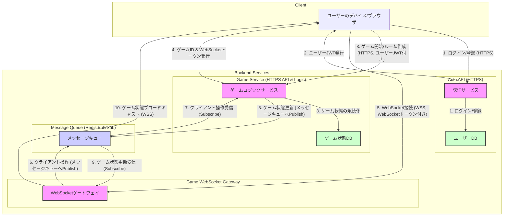

```mermaid
graph TD
    subgraph Client
        C[ユーザーのデバイス/ブラウザ]
    end

    subgraph Backend Services
        subgraph "Auth API (HTTPS)"
            A[認証サービス]
            A -- 1. ログイン/登録 --> DB_Auth[ユーザーDB]
        end

        subgraph "Game Service (HTTPS API & Logic)"
            G[ゲームロジックサービス]
            G -- 3. ゲーム状態の永続化 --> DB_Game[ゲーム状態DB]
        end

        subgraph Game WebSocket Gateway
            W[WebSocketゲートウェイ]
        end

        subgraph "Message Queue (Redis Pub/Sub)"
            MQ[メッセージキュー]
        end
    end

    C -- 1. ログイン/登録 (HTTPS) --> A
    A -- 2. ユーザーJWT発行 --> C

    C -- 3. ゲーム開始/ルーム作成 (HTTPS, ユーザーJWT付き) --> G
    G -- 4. ゲームID & WebSocketトークン発行 --> C

    C -- 5. WebSocket接続 (WSS, WebSocketトークン付き) --> W

    W -- 6. クライアント操作 (メッセージキューへPublish) --> MQ
    MQ -- 7. クライアント操作受信 (Subscribe) --> G

    G -- 8. ゲーム状態更新 (メッセージキューへPublish) --> MQ
    MQ -- 9. ゲーム状態更新受信 (Subscribe) --> W

    W -- 10. ゲーム状態ブロードキャスト (WSS) --> C

    style A fill:#f9f,stroke:#333,stroke-width:2px
    style G fill:#f9f,stroke:#333,stroke-width:2px
    style W fill:#f9f,stroke:#333,stroke-width:2px
    style MQ fill:#ccf,stroke:#333,stroke-width:2px
    style DB_Auth fill:#cfc,stroke:#333,stroke-width:2px
    style DB_Game fill:#cfc,stroke:#333,stroke-width:2px
```
